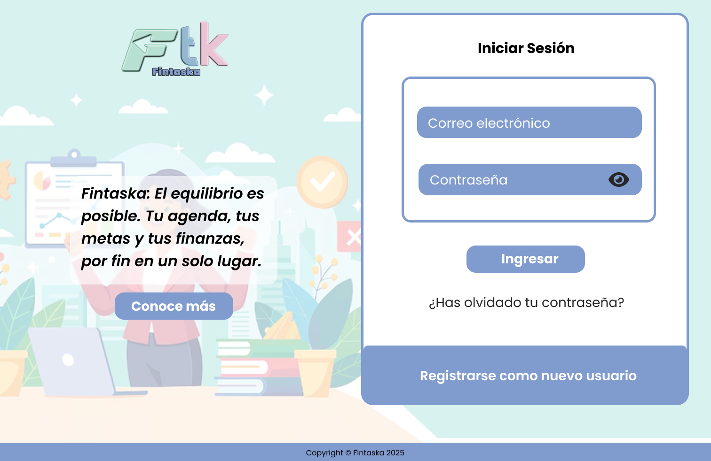

# Fintaska

Esta es una aplicación web para la organización personal y financiera en un mismo lugar. Obteniendo resultados visuales en organizador financiero a través de gráficos y gestión de tareas con un planner integrado, además de una sección creativa para guardar notas, imagenes o documentos importantes.

## Funciones principales

- Planner
- Control financiero personal
- Notificaciones de fechas importantes
- Tips y consejos motivacionales
- Espacio creativo para notas y guardar imágenes y/o documentos
- Espacio personalizado para cada usuario


## Autores

- Laura Paola Daza [@lapao-db](https://github.com/lapao-db)
- Daniela Fajardo Ordoñez [@DanielaFajardo2315](https://github.com/DanielaFajardo2315)
- Yesmy Carolina Jimenez [@yescarjim](https://github.com/yescarjim/)

## Requisitos previos

Este proyecto fue desarrollado a través de MEAN Stack usando las siguientes herramientas:

- Node.js
- Express
- MongoDB
- Angular

Las dependencias y herramientas necesarias para el funcionamiento de este proyecto son:

- Dependencias directas de Angular

## Paleta de colores

| Color             | Hex                                                                |
| ----------------- | ------------------------------------------------------------------ |
| Rosado pastel | #eac4d5 |
| Verde claro pastel | #d6eadf |
| Verde mental | #b8e0d2 |
| Azul claro pastel | #95b8d1 |
| Azul pastel | #809bce |

## Mockups del proyecto

### Inicio de sesión
</img>
</img>

### Inicio
</img>

### Notificaciones
</img>

### Finanzas
</img>

### Planeador
</img>

### Tablero
</img>
</img>

### Perfil
</img>
</img>

### Administrador
</img>

### Not Found
</img>

## Instrucciones de instalación y ejecución

Para instalar y ejecutar este proyecto exitosamente deberá:

- Debe tener Node.js y Angular CLI instalado en su equipo.
- Instale las dependencias necesarias:
```bash
  npm i
```

- Ejecute la aplicación web

```bash
  ng serve -o
```

- La aplicación se ejecutará en el navegador para interacturar con ella.

- Si desea finalizar la ejecución oprima los botones Ctrl + C
## Estado del proyecto

Este proyecto se encuentra en desarollo...